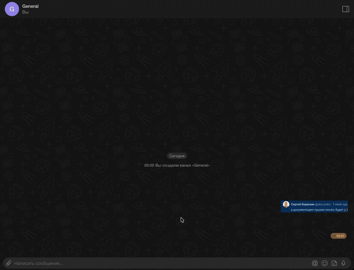

# amo stickers

Стикеры и GIF для мессенджера amo в браузере: кнопка стикеров в строке ввода рядом с кнопкой эмодзи, отправка одним
кликом.



- **Свои стикеры** — из картинки, GIF, видео или анимированного стикера Telegram (`.tgs`), с подписью или без.
- **Паки из Telegram** — импорт целого пака по ссылке на него через своего бота Telegram.
- **Поиск GIF** — GIPHY и KLIPY по своему бесплатному ключу, недавние GIF всегда под рукой.
- **Отправка кликом** — собеседник получит стикер картинкой GIF, даже если amo stickers у него нет.

**[Установить →](https://mcar2107.github.io/amo_msg_stickers/install/)** — пошаговая инструкция для Chrome,
Яндекс Браузера, Edge, Opera, Firefox и Safari.

Прямые ссылки на последнюю версию:
[скачать архив расширения](https://github.com/mcar2107/amo_msg_stickers/releases/latest/download/amo-stickers.zip) ·
[установить userscript](https://github.com/mcar2107/amo_msg_stickers/releases/latest/download/amo-stickers.user.js).

[Документация](https://mcar2107.github.io/amo_msg_stickers/) ·
[Частые вопросы](https://mcar2107.github.io/amo_msg_stickers/faq) ·
[Политика конфиденциальности](https://mcar2107.github.io/amo_msg_stickers/privacy) ·
[Сообщить о проблеме](https://github.com/mcar2107/amo_msg_stickers/issues)

## Разработка

Одно ядро на TypeScript собирается в расширение Chrome (MV3) и userscript. Устройство, соглашения и правила — в
[CLAUDE.md](./CLAUDE.md).

```bash
pnpm i
pnpm build             # dist/extension/* и dist/amo-stickers.user.js
pnpm watch             # пересборка при изменениях
pnpm lint              # eslint + typecheck + prettier --check
pnpm test              # vitest
pnpm docs:dev          # сайт доки локально (исходники — docs/)
```

Pre-commit гоняет lint-staged, typecheck и тесты по изменённым файлам. На каждый PR в `master` CI проверяет линт,
типы, тесты, сборку, сборку доки и версию, а после мержа выпускает релиз.

**Стенд.** `dev/harness.html` повторяет разметку поля ввода и ленты amo; вставка и «Отправить» в нём замоканы. Для
стилей положите CSS страницы amo в `dev/amo.css` (в git не лежит).

```bash
python3 -m http.server 8777 -b 127.0.0.1
open http://127.0.0.1:8777/dev/harness.html
```
