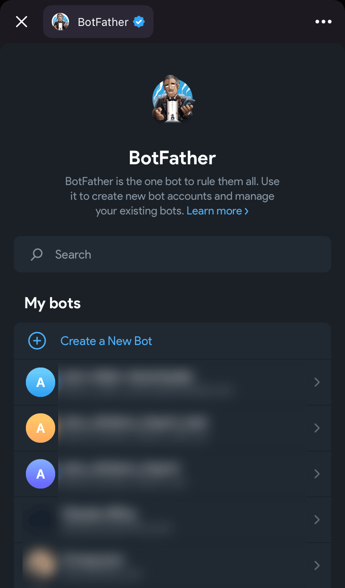
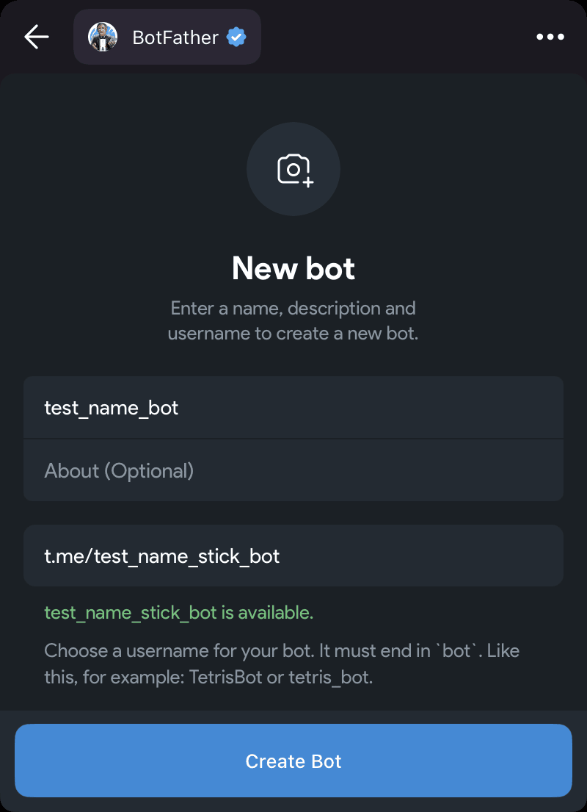
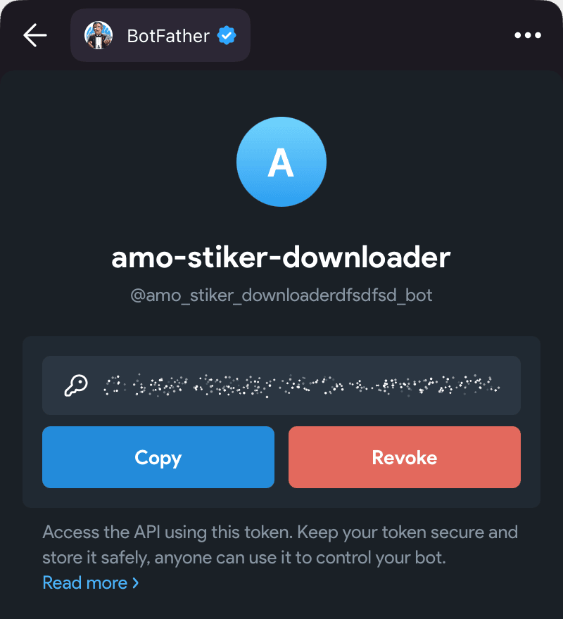
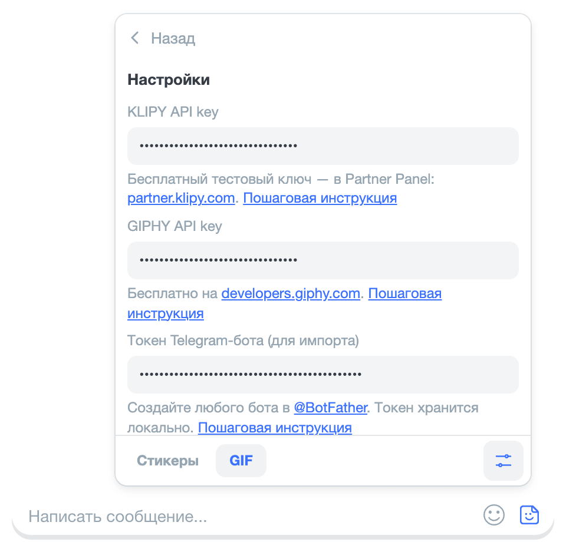
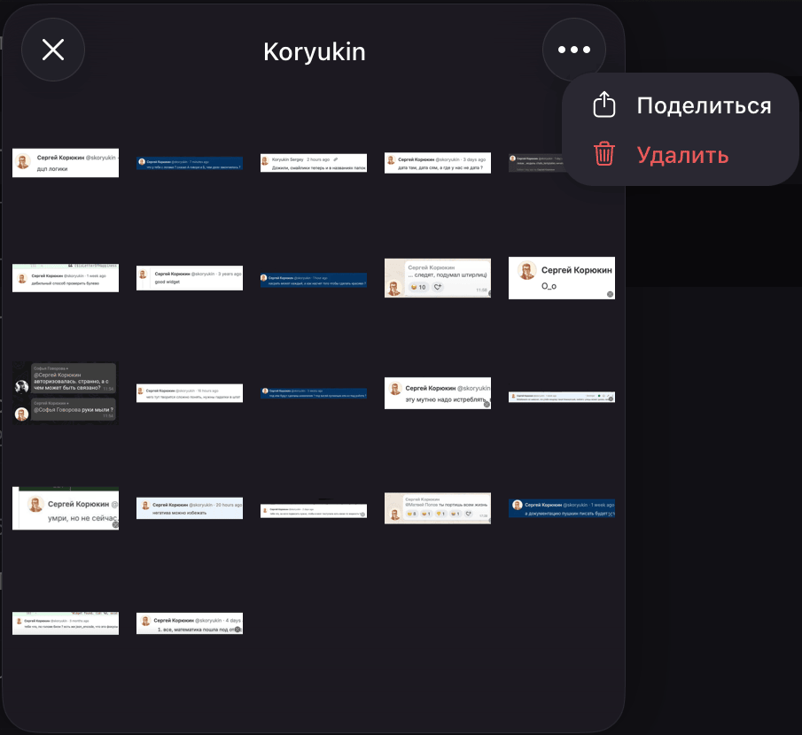
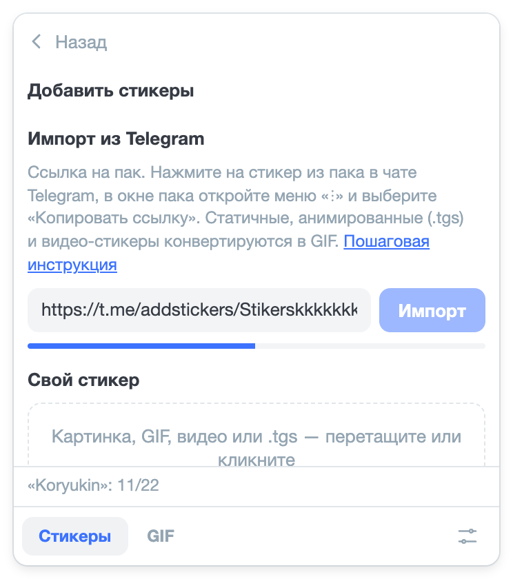

# Import from Telegram

You can add a whole Telegram sticker pack to amo stickers: the stickers will become GIFs and appear in the feed as a
separate section. Static, animated (`.tgs`) and video stickers are converted.

Importing requires your own Telegram bot: amo stickers downloads the pack through the Bot API, and without a bot token
Telegram doesn’t give out sticker files. You only need to create the bot once — you don’t need to add it to chats or
set anything up in it.

::: warning The token is a secret
The bot token gives full control over the bot: anyone with it can write on behalf of the bot and change it. Don’t
forward the token in chats or show it in screenshots.

amo stickers stores the token only in your browser and sends it only to Telegram (`api.telegram.org`). If the token
has leaked to someone anyway, issue a new one: open the bot in @BotFather, click “Revoke” and paste the new token into
“Settings” instead of the old one.
:::

## 1. Create a bot

1. Open [@BotFather](https://t.me/BotFather) in Telegram — the official Telegram bot for creating bots — and click
   “Open” on the button at the bottom of the chat: the @BotFather window with the list of your bots will open.
2. In the “My bots” section, click “Create a New Bot”.

3. Enter the bot name — anything, for example `amo stickers`: the bot is only needed for importing. You can leave the
   description (“About”) empty.
4. Enter the bot username — Latin letters, digits or `_`; it must end with `bot`, for example
   `alex_amo_stickers_bot`. @BotFather will show right below the field whether the username is available.
5. Click “Create Bot”.

The old Telegram interface has no such window: there you create a bot with the `/newbot` command in the chat with
@BotFather, and it will ask for the name and the username in messages.

## 2. Copy the token

After the bot is created, the bot page with the token opens — a string like `1234567890:AAH…`. Click “Copy”: the whole
token will be copied.

You can copy the token again at any time: open @BotFather, choose the bot in “My bots” and click “Copy”.

## 3. Paste the token into “Settings”

1. Open amo and hover over the sticker button in the message field or click it.
2. Click “Settings” at the bottom of the panel.
3. Paste the token into the “Telegram bot token (for import)” field and click “Save”. “Saved” will appear at the bottom
   of the panel.

## 4. Copy the pack link {#pack-link}

**Click a sticker from the pack in a Telegram chat, open the “⋮” menu in the pack window and choose “Copy Link”.**

The path is the same in the Telegram desktop app, the web version and on the phone; in some apps the menu is marked
“…” rather than “⋮”. Telegram for macOS has no “Copy Link” item in the menu: choose “Share” and click the copy link
button in the top right corner of the chat selection window. You can also copy the link to a pack you have already
added from the settings: “Settings” → “Stickers and Emoji” → click the pack → the “⋮” menu → “Copy Link”.

The link looks like this: `https://t.me/addstickers/Name`. A link to an emoji pack (`t.me/addemoji/Name`) or just the
pack name — the part of the link after the last `/` — works too.

## 5. Import the pack

1. In amo stickers, open the “Stickers” mode and click “+” to the right of the section tabs — the “Add stickers”
   screen will open.
2. In the “Import from Telegram” section, paste the link into the field and click “Import”.
3. Wait for the import to finish: the panel shows a sticker count at the bottom, for example **“Pack name”: 12/40**,
   and at the end **Pack “Pack name” added**. While the import is running, the panel doesn’t close if you move the
   cursor away from it.

The pack will appear as a separate tab in the “Stickers” mode. The stickers of each pack are converted once during
import — after that they are sent right away.

## If it didn’t work

- **“Enter the bot token in settings”** — the token isn’t saved: go back to step 3 and click “Save”.
- **“Couldn’t parse the link. Expected t.me/addstickers/Name”** — the field doesn’t contain a pack link. Copy it again
  following step 4.
- **“HTTP 401 … Unauthorized”** — Telegram didn’t accept the token. Check that the token is copied in full, or get it
  again following step 2 and paste it into “Settings”.
- **“HTTP 400 … STICKERSET_INVALID”** — Telegram didn’t find the pack. Check that the pack opens from the link in
  Telegram itself, and copy the link again following step 4.

Other questions are in the [“FAQ”](../faq) section.
